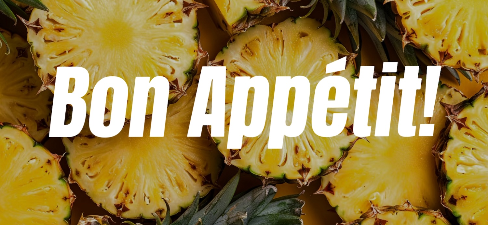

# Welcome to Nora and Reilly's Homemade Studio! {.tabset}
### Only for family and friends.


## Background
### 🧑‍🍳Reilly: What's for dinner?
### 👩🏻‍🌾Nora: I don't know. What do you want?
### 🧑‍🍳Reilly: IDK either. You pick.
### 👩🏻‍🌾Nora: No, It's your turn.
### 🧑‍🍳Reilly: Any options?
### 👩🏻‍🌾Nora: Ehhhh, Give me one sec, I will build you a website....
### THEN...


## Welcome words
### 👩🏻‍🌾Nora:  
#### G'day mate, How ya doing?
#### Welcome to Nora and Reilly's homemade studio. 
#### I built this menu to welcome you guys. You can order anything you want. And also stop Reilly from struggling. Have fun~

### 🧑‍🍳Reilly: 
#### What's goodie? 
#### Welcome to Reilly & Nora restaurant. We hope you enjoy our cooking and leave us a favourable tip.

### 🐶Xiaobao:
#### Give me a bite! pleeeease~


```{r setup, include=FALSE}
knitr::opts_chunk$set(echo = FALSE, warning = FALSE, message = FALSE)
library(dplyr)
library(DT)
library(knitr)
```


```{r load in data}
menu <- read.csv("menu.csv",stringsAsFactors = FALSE) %>% 
  mutate(
    Image_HTML = paste0(
    ''
    )
  ) %>% 
  mutate(reilly_liking_degree = strrep("⭐️", as.numeric(reilly_liking_degree))) %>% 
  mutate(nora_liking_degree = strrep("🌸", as.numeric(nora_liking_degree)))
```

## Check out the menu!
```{r menu display}
menu_display <- menu %>% 
  select(
    '🍱Dish name' = dish_name,
    '🍽️category' =category,
    '🍖type' = diet_type,
    'Reilly liking level' = reilly_liking_degree,
    'Nora liking level' = nora_liking_degree,
    'Description' = description,
    '🌶️spicy leve '=  spicy_level,
    'image' = Image_HTML
  )
DT::datatable(
  menu_display,
  filter = 'top',
  escape = FALSE,
  selection = 'multiple',
  options = list(
    pageLength = 5,
    scrollX = TRUE,
    columnDefs= list(
      list(orderable = FALSE, targets = which(names(menu_display) == "image") - 1)
    )
  )
)
```


